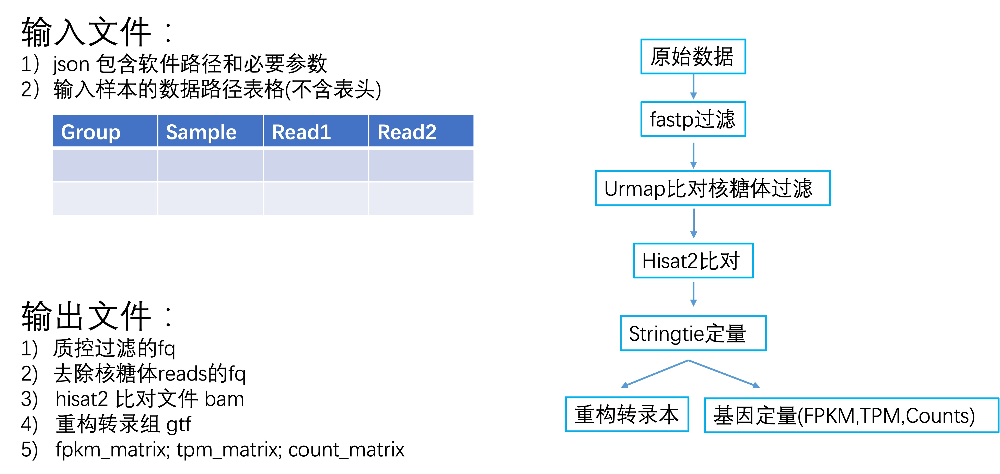

# Bulk RNAseq 分析流程

**Bulk RNAseq 分析流程** 是一个基于 WDL 构建的转录组分析流程，它集成了多个分析步骤，旨在实现高效的RNA测序数据分析。

## 所使用的分析软件

在此流程中，我们使用了以下分析软件：

1. **fastp** - 用于质量控制
   - 描述：fastp 是一个快速的、全功能的 FASTQ 文件预处理工具，用于对测序数据进行质量控制和数据清洗。

2. **bowtie2** - 用于去除核糖体序列
   - 描述：bowtie2 是一种用于比对测序数据到参考基因组的工具，我们在此流程中使用它来去除核糖体序列。

3. **Hisat2** - 用于基因组比对
   - 描述：Hisat2 是一种用于高通量测序数据比对到参考基因组的软件，用于将测序数据比对到参考基因组。

4. **StringTie** - 用于转录本组装和定量
   - 描述：StringTie 是一个工具，用于从 RNA-seq 数据中重新构建转录本和估算基因表达水平。

5. **DESeq2** - 用于差异表达分析
   - 描述：DESeq2 是一个用于差异基因表达分析的 R 包，用于识别不同条件下基因的显著差异。

6. **ClusterProfiler** - 用于富集分析
   - 描述：ClusterProfiler 是一个 R 包，用于进行生物学功能富集分析，帮助理解差异基因的功能特点。

7. **WGCNA** - 用于基因权重共表达网络分析（计划中）
   - 描述：WGCNA 是一种用于构建基因共表达网络并进行模块化分析的工具，用于揭示基因之间的关系。

## 更新日志

请查看 [CHANGELOG](./CHANGELOG.md) 以获取详细的更新历史。

## 更新计划

- [ ] 增加过程选择，允许自由选择从其中一个步骤开始
- [ ] 增加数据质控的表格处理

## 流程图



## 环境要求

在运行该流程之前，请确保您的环境满足以下要求：

- Python 3.6+
- collect_columns
- Samtools
- StringTie
- GffCompare
- preDE
- Bowtie2
- Fastp
- Mapping_software
- Pigz

## 安装

您可以通过以下命令从 GitLab 直接克隆该仓库到您的本地目录，请修改 `input.json` 文件中的路径。

```bash
git clone https://gitlab.genomics.cn/iori/phi/bulk-rna-seq.git
```

# 运行

## 测序数据

需要将测序数据整理成下列表格形式, 制表符分割, 不要header

1. 第一类是group信息
2. 第二列是样本名称
3. 第三列是read1的绝对路径(gz压缩格式, 后缀名改成.fastq.gz)
4. 第四列是read2的绝对路径(gz压缩格式, 后缀名改成.fastq.gz)

有多少样本就有多少行. (注意一个样本多个fq文件的, 自己用cat或者zcat合并)
```
Group	ERR188044	/hwfssz5/ST_HEALTH/P21Z10200N0092/wangjiaxuan/RNAseq/test1/test/chrX_data/samples/ERR188044_chrX_1.fastq.gz	/hwfssz5/ST_HEALTH/P21Z10200N0092/wangjiaxuan/RNAseq/test1/test/chrX_data/samples/ERR188044_chrX_2.fastq.gz
Group	ERR188104	/hwfssz5/ST_HEALTH/P21Z10200N0092/wangjiaxuan/RNAseq/test1/test/chrX_data/samples/ERR188104_chrX_1.fastq.gz	/hwfssz5/ST_HEALTH/P21Z10200N0092/wangjiaxuan/RNAseq/test1/test/chrX_data/samples/ERR188104_chrX_2.fastq.gz

```

## 输入文件(修改配置文件)

输入文件是json格式，需要提供对应文件和软件的路径。 这个文件是非常重要的输入文件，
但是大部分的软件版本是不用改的。
需要改动有`RNAseq.matedata_tsv`,`RNAseq.rrna_index`,`RNAseq.genome_index`,`RNAseq.annot_gtf`,`RNAseq.read_length`,其他不用修改，
其中RNAseq.matedata_tsv对应的表格必须是制表符分割的tsv文件，包括四列，
第一列是分组，第二列是样本名称，第三列是read1的fq文件，第四列是read2的fq文件。

> 注意要严格按照规范，整理输入文件，否则必报错或者输出结果不对。

```json
{
    "RNAseq.matedata_tsv" : "/data2/wangjiaxuan/ZJ-01/5.HostGene_EXP/hostrna_input.tsv",
    // 输入文件的表格，***非常重要且必须的***
    "RNAseq.rrna_index" : "/data3/Group7/wangjiaxuan/refer/rRNA_Data/bowtie2_index/rRNA",
    //去核糖体的序列index，***非常重要且必须的***
    "RNAseq.genome_index":"/data3/Group7/wangjiaxuan/workflow/bulk-rna-seq/test/chrX_data/indexes/chrX_tran",  
    // hisat2构建的全基因组索引 ***非常重要且必须的***
    "RNAseq.annot_gtf" : "/data3/Group7/wangjiaxuan/workflow/bulk-rna-seq/test/chrX_data/genes/chrX.gtf",
    //基因组的注释文件gtf ***非常重要且必须的***
    "RNAseq.read_length" : "150",
    //read 长度，一般而言，华大是100，illumina是150 ***非常重要且必须的***
    "RNAseq.regtf" : "false", 
    //是否需要重构转录本，默认是不需要重构转录本。
    // ------------分割线-----------------------
    // ------------下面全是软件的文件途径---------
    "RNAseq.python" : "/data3/Group7/wangjiaxuan/biosoft/miniconda3/bin/python",
    "RNAseq.collect_columns" : "/data3/Group7/wangjiaxuan/biosoft/miniconda3/envs/rnaseq/bin/collect-columns",
    "RNAseq.samtools" : "/data3/Group7/wangjiaxuan/biosoft/miniconda3/envs/rnaseq/bin/samtools",
    "RNAseq.stringtie" : "/data3/Group7/wangjiaxuan/biosoft/miniconda3/envs/rnaseq/bin/stringtie",
    "RNAseq.gffcompare" : "/data3/Group7/wangjiaxuan/biosoft/miniconda3/envs/rnaseq/bin/gffcompare",
    "RNAseq.preDE" : "util/preDE.py",
    "RNAseq.bowtie2" : "/data3/Group7/wangjiaxuan/biosoft/miniconda3/envs/rnaseq/bin/bowtie2",
    "RNAseq.fastp" : "/data3/Group7/wangjiaxuan/biosoft/miniconda3/bin/fastp",
    "RNAseq.mapping_software" : "/data3/Group7/wangjiaxuan/biosoft/miniconda3/envs/rnaseq/bin/hisat2",
    "RNAseq.pigz" : "/data3/Group7/wangjiaxuan/biosoft/miniconda3/envs/rnaseq/bin/pigz"
}

```

## 测试DEMO

前期准备：
1）下载test数据集合：

```bash
mkdir test
cd test
bash download_test_data.sh
```
根据要求的matedata_tsv要求的格式整理表格，修改`WDL/input.RNAseq.json`

2) 运行需要有cromwell.jar文件，所以需要先下载。

```bash
bash download_cromwell.sh
```

3) 然后运行：

```
./run_RNAseq -i WDL/input.RNAseq.json
```

4) 等待结果出来

## 输出结果

1. 质控过滤的fq
2. 去除核糖体reads的fq
3. hisat2 比对文件 bam
4. 重构转录组 gtf 
5. fpkm_matrix; tpm_matrix; count_matrix

## 维护

王家轩(poormouse@126.com)

